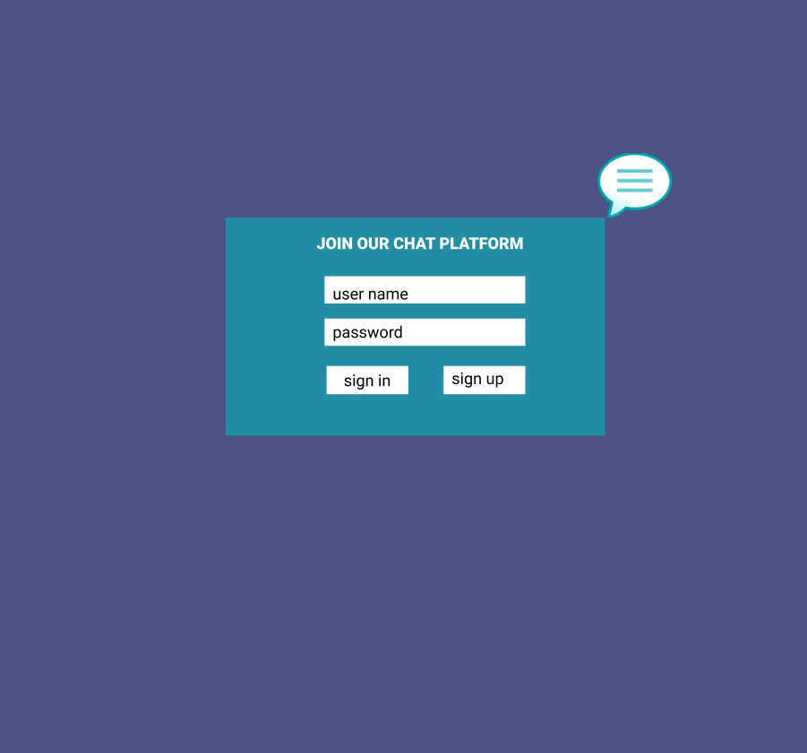
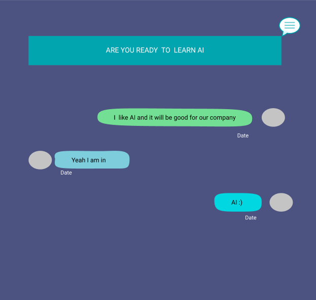

# Development Strategy

> `Chat-Forum`

will be filled later

## WIREFRAME

 

---

## 0. Set-Up

_A User can see the initial repository and live demo_

### Repository

- Created a new repository
- Clone the repository
- Write initial, basic README
- Start the development strategy
- Prepare a project board
- Push the changes to GitHub
- Turn on GitHub Pages
